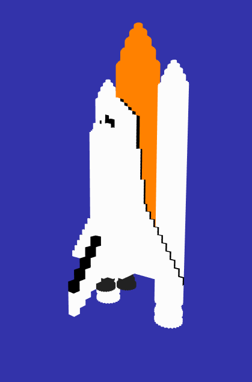
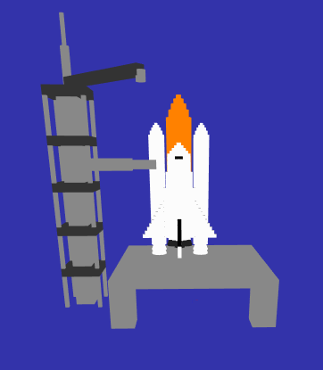
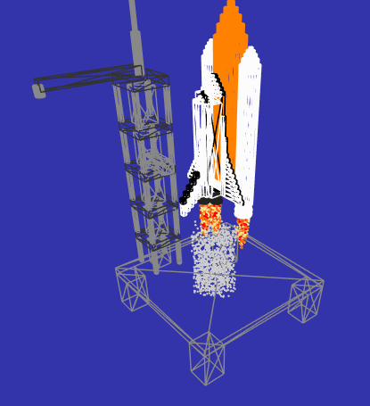

# Report di progetto - Turus Davide, Iop Alessandro
## Parte 1: idee
La prima idea era stata di realizzare un'ambientazione ricollegabile al Signore Degli Anelli, in particolare le fortezze di Minas Tirith o di Barad-Dur, con particolare cura nei dettagli architettonici. L'animazione sarebbe stata il movimento delle mura che crollano nel primo caso e il movimento dell'occhio di Sauron assieme all'apertura dei cancelli neri nel secondo. Tuttavia, per motivi di tempo e originalità della stessa, l'idea è stata subito scartata.
La scelta è stata quindi di optare per la costruzione di un ambiente rappresentante la base di lancio di uno space shuttle. Per l'animazione si è optato di rappresentare il lancio dello stesso, con effetti di fiamme e fumo alla base, nonché la rotazione dei bracci meccanici della torre per simulare la ripresa di un lancio spaziale.

## Parte 2: modellazione dello space shuttle
Al fine di rendere il lavoro di realizzazione più semplice e veloce possibile, lo shuttle è stato modellato a partire da un parallelepipedo centrale con funzione di "scheletro", sulla superficie del quale sono stati poi apposti dei box più piccoli, di dimensioni variabili, per definire i dettagli e le componenti del veicolo più piccole. Sono state realizzate, tra le altre cose, le ali, i propulsori, la punta, il serbatoio e i razzi. Tutte le componenti sono modulari e dipendono da tre variabili numeriche indicanti approssimativamente le dimensioni del suddetto "scheletro", in forma di sottrazione o di divisione di tali parametri; le proporzioni del velivolo sono quindi impostate "ad occhio".
In una seconda fase, sono state progettate le prime animazioni da applicare successivamente, cioè il movimento dello shuttle in alto proceduto dalla rotazione/ritrazione dei bracci della torre di lancio. E' seguito lo sviluppo delle fiamme e la colonna di fumo che si sprigionano dai propulsori dello shuttle. Questi elementi sono generati e gestiti come entità separate, create e animate in funzioni separate all'interno del codice, "attaccate" alla base del veicolo che funge da pivot.

## Parte 3: generazione del terreno
Per evitare una riduzione degli fps ulteriore, considerando che già le animazioni risultano piuttosto impegnative da questo punto di vista, lo sviluppo del terreno a partire da una heightmap è stato volutamente progettato in maniera essenziale e "minimalista". In virtù di questo,...

## Parte 4: integrazione del codice
Come è possibile attestare, l'intero codice è contenuto in un unico file complessivo, che non ricorre quindi a chiamate esterne se non alla libreria di three.js. La decisione è dovuta principalmente alla necessità di avere sempre il codice sotto mano per tutte le componenti (strutturali e di animazione), oltre a facilitare la gestione delle variabili globali e il passaggio di parametri tra le funzioni. Durante lo sviluppo del progetto si è adottato, in generale, un approccio "incrementale": si procedeva per piccole introduzioni, che venivano testate isolatamente, per poi venire integrate a gruppi o singolarmente; ad ogni step si verificava che il codice funzionasse come desiderato prima di procedere allo step successivo. Particolare cura è stata posta nella regolazione dei parametri di animazione, in ottica di un risparmio di fps e in vista della generazione finale del terreno (vedi parte 3). Una volta introdotte tutte le componenti nel codice, ci si è preoccupati di aggiustare i dettagli di presentazione.

## Parte 5: risultati
Vengono presentati di seguito alcuni screenshot del lavoro in fase di sviluppo e a lavoro finito, accompagnato da alcune gif integrative.

||
|:--:|
|*Costruzione dello space shuttle.*|

||
|*--*|
|*Posizionamento dello space shuttle a veicolo fermo sulla piattaforma di lancio.*|

||
|*--*|
|*Regolazione della posizione e dell'estensione degli effetti di fiamme e fumo in modalità wireframe.*|

||
|*--*|
|*Simulazione del lancio dello space shuttle, fase di testing.*|

||
|*--*|
|*Simulazione del riposizionamenti dello space shuttle, una volta che si è esaurita l'animazione.*|