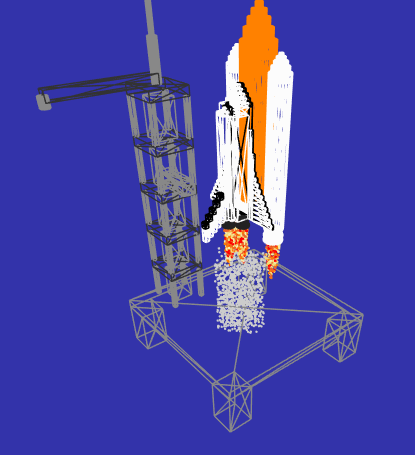

# Journal di progetto - Turus Davide, Iop Alessandro
## 26-03-2018
* Costruzione del corpo principale dello space shuttle:
    * impostazione delle misure principali di riferimento;
    * definizione della funzione Shuttle();
    * dichiarazine e istanziazione dei materiali che costituiranno le varie parti di diverso colore;
    * dichiarazione e istanziazione delle variabili base_geometry, base_shuttle, base_geometry2, base_shuttle2, base_geometry3, base_shuttle3, black_base_geometry, black_base_shuttle.
* Posizionamento del corpo principale dello space shuttle con tutte le sue componenti.
* Impostazione della posizione e orientazione della camera.

## 27-03-2018
* Costruzione delle componenti aggiuntive dello space shuttle:
    * impostazione delle misure di ali e punta in proporzione alle misure del corpo principale;
    * dichiarazione e istanziazione delle variabili base_punta_geometry, base_punta_shuttle, base_vetro_geometry, base_vetro, punta_vetro_geometry, punta_vetro, base_punta2_geometry, base_punta2, base_punta3_geometry, base_punta3, base_punta4_geometry, base_punta4, block_punta e geometry (per iterare la costruzione dei blocchi laterali della punta);
    * dichiarazione e istanziazione delle variabili ala_geometry, ala_white_dx, ala_white_sx, ala_black_dx, ala_black_sx, geometry_ala1, white_ala1_dx, black_ala1_dx, white_ala1_sx, black_ala1_sx, geometry_ala2, white_ala2_dx, black_ala2_dx, white_ala2_sx, black_ala2_sx per la creazione delle ali laterali;
    * dichiarazione e istanziazione delle variabili ala_front_white_geometry, ala_front_white, ala_front_black_geometry, ala_front_black per la creazione dell'ala dorsale.
* Posizionamento delle ali e della punta dello space shuttle in modo che si trovino ai lati del corpo principale, attaccate ad esso.

## 28-03-2018
* Costruzione dei propulsori dello space shuttle:
    * impostazione delle misure dei propulsori in proporzione alle misure del corpo principale;
    * dichiarazione e istanziazione delle variabili propulsori_geometry, mesh_propulsori, mesh_propulsori1, mesh_propulsori2, mesh_propulsori3.
* Posizionamento dei propulsori dello space shuttle in modo che si trovino sotto al corpo principale, attaccati ad esso.
* Costruzione del serbatoio esterno allo space shuttle:
    * definizione della funzione External_tank();
    * impostazione delle misure delle misure del serbatoio in proporzione alle misure del corpo principale;
    * dichiarazione e istanziazione delle variabili orange_material, tank_base_geomtery, external_tank_base, tank_punta_geometry, external_tank_punta.
* Posizionamento del serbatoio esterno allo space shuttle in modo che si trovi allineato al corpo principale, dal lato nero, e rialzato rispetto al "terreno".
* Aggiunta del serbatoio allo space shuttle come componente.

## 29-03-2018
* Costruzione dei razzi laterali dello space shuttle:
    * definizione della funzione Razzo();
    * impostazione delle misure dei razzi in proporzione alle misure del corpo principale;
    * dichiarazione e istanziazione delle viariabili white_material, razzo_base_geometry, razzo_base, razzo_punta_geometry, razzo_punta, razzo_propulsori_geometry, razzo_propulsori.
* Posizionamento dei razzi laterali dello space shuttle in modo che si trovino ai lati del serbatoio centrale, attaccati ad esso (sono due razzi sostanzialmente uguali ma distinti solo per la variabile pos in sinistro e destro).
* Aggiunta dei razzi allo space shuttle come componenti.

||
|:--:|
|*Costruzione dello space shuttle.*|

## 30-03-2018
* Costruzione della torre di lancio dello space shuttle:
    * definizione della funzione Tower();
    * impostazione delle misure della torre indipendentemente dalle dimensioni dello space shuttle;
    * dichiarazione e istanziazione delle variabili tower_grey_material, tower_base_geometry, tower_column_geometry, tower_base_column_geometry, tower_column1, tower_column2, tower_column3, tower_column4, tower_base_column, tower_base per la creazione del corpo principale;
    * dichiarazione e istanziazione delle variabili tower_mid_arm_base, tower_mid_arm_top, tower_top_arm, mid_arm_base_geometry, tower_mid_arm_base, mid_arm_top_geometry,tower_mid_arm_top, top_arm_geometry, tower_top_arm1, arm_connections_geometry, tower_arm_connection, shuttle_arm_connection, tower_punta_geometry, tower_punta per la creazione delle braccia e della punta della torre.
* Posizionamento della torre di lancio dello space shuttle in modo che si trovi al suo lato e le braccia siano attaccate alla sua punta e al suo corpo principale.

## 31-03-2018
* Costruzione della piattaforma di lancio dello space shuttle:
    * definizione della funzione Launch_base();
    * impostazione delle misure della piattaforma indipendentemente dalle dimensioni dello space shuttle e della torre di lancio;
    * dichiarazione e istanziazione delle variabili launch_base, base_material, base_column_geometry, base_column1, base_column2, base_column3, base_column4, base_plain_geometry, base_plain.
* Posizionamento della piattaforma di lancio dello space shuttle in modo che si trovi al di sotto di esso e attaccato ad esso.
* Definizione della funzione Animation():
    * controllo dello stato dello space shuttle (fermo o in movimento);
    * definizione della funzione Arm_detachment();
    * definizione della funzione Launch();
    * dichiarazione e istanziazione delle variabili time e durataAnimazione.

||
|:--:|
|*Posizionamento dello space shuttle a veicolo fermo sulla piattaforma di lancio.*|
    
## 06-04-2018
* Cambiamento dei piani near e far della camera per ridurre lo z-figthing.
* Ri-dichiarazione di alcune variabili come variabili globali.
* Spostamento della camera.
* Allungamento del tempo di durata dell'animazione.
* Definizione della funzione Smoke_creation():
    * dichiarazione e istanziazione delle variabili smoke_geometry, smoke_material, smoke, smoke_column.
* Definizione della funzione Smoke_animation():
    * dichiarazione e istanziazione delle variabili posx, posy, posz, soglia.
* Posizionamento del fumo di lancio in modo che parta dai propulsori e si estenda fino a terra inizialmente, per poi mantenere un'altezza fissa una volta raggiunta una certa quota.
* Integrazione delle varie componenti dello space shuttle e delle strutture di lancio in un unico file.
* Definizione della funzione Flames_creation():
    * dichiarazione e istanziazione delle variabili flames_geometry, flames_materials, flames.
* Definizione della funzione Flames_animation:
    * dichiarazione e istanziazione delle variabili pivot_reference, pivot;
    * chiamata al metodo in Launch() tramite le variabili flames_propulsore1, flames_propulsore2, flames_propulsore3, flames_razzo_dx,flames_razzo_sx, flames1, flames2, flames3, flames4, flames5.

||
|:--:|
|*Regolazione della posizione e dell'estensione degli effetti di fiamme e fumo in modalità wireframe.*|

||
|:--:|
|*Simulazione del lancio dello space shuttle, fase di testing.*|
    
## 07-04-2018
* Movimento della camera in modo che segua lo space shuttle durante l'animazione:
    * sostituzione del metodo lookAt() con l'impostazione dell'attributo target di OrbitControls;
    * impostazione della posizione iniziale della camera;
    * impostazione degli attributi autoRotate e autoRotateSpeed dei controlli.
* Creazione di un ambiente complessivo (environment) che contiene lo space shuttle, la torre e la piattaforma di lancio.
* Definizione della funzione Reposition():
    * controllo del movimento di riposizionamento dello shuttle e delle braccia della torre alle posizioni originarie una volta che l'animazione è terminata;
    * dichiarazione e istanziazione delle variabili riposizionato, angolo_return.
* Ri-definizione della funzione Launch():
    * aggiunta del controllo della durata dell'animazione e gestione della visibilità delle fiamme e del fumo durante il riposizionamento;
    * reset della posizione e del movimento della camera alla fine dell'animazione.
* Creazione del terreno su cui poggia lo space shuttle a partire da una height map:
    * integrazione della funzione getHeightData();
    * definizione della funzione Terreno();
    * dichiarazione e istanziazione delle variabili data, geometry, material1, material2, material3, terreno, img.

||
|:--:|
|*Simulazione del riposizionamenti dello space shuttle, una volta che si è esaurita l'animazione.*|

||
|:--:|
|*Costruzione del terreno.*|

## 08-04-2018
* Ridimensionamento e riposizionamento del terreno, in modo che l'environment poggi su di esso e non venga ridotto il frame rate della scena:
    * ingrandimento dei cubi;
    * variazione della posizione di ogni cubo e della scalatura sull'asse y in relazione a una variabile scale_value.
* Inserimento dell'environment e del terreno in una sfera, nella cui faccia interna è stata applicata uno sfondo come texture:
    * impostazione delle dimensioni della sfera;
    * dichiarazione e istanziazione delle variabili skySphere, Sky_geometry, loader, Sky_material;
    * impostazione di una distanza massima di zoom out per evitare la fuoriuscita dalla sfera contenitiva.
* Modifica dei livelli di grigio su cui mappare l'altezza dei vari strati del terreno.
* Controllo della durata dell'animazione.

||
|:--:|
|*Integrazione, ingrandimento e riposizionamento del terreno.*|